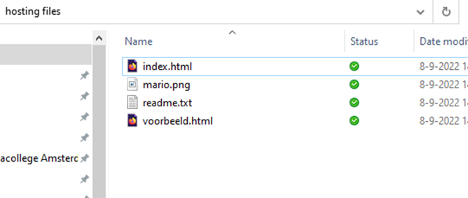
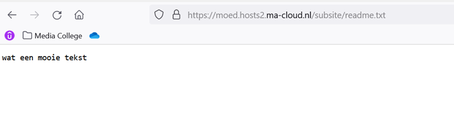

## hosting oefening

- Download les 03 hosting files.zip
* Teams M1 SKIL -> general -> files `les 03 hosting files.zip`
* of download de zip vanuit deze git

- pak de file uit (rechten muis, extract here)
* een zip file is 1 bestand waar 1 of meerdere bestanden in kunnen zitten

## Files op de host plaatsen

we gaan nu de files op onze ma host plaatsen:

- `Index.html` komt in de webroot (web)
- In `web` maak je een directory met de naam `img`
- In de `img` directory zet je `mario.png`
- In de `web` maak je nog een directory met de naam `subsite`
- In `subsite` zet je `voorbeeld.html`
- `Readme.txt` komt in de `subsite``

## Ok en hoe vraag ik die op?

- maak een tekstfile aan: `opdrachtlinks.txt`

Open de volgende bestanden die op je ma-cloud staan in je browser 

- Index.html
- Readme.txt
- Voorbeeld.html
- Het Plaatje mario.png

Open nu de index.html van de student naast je

- plaats alle links om naar de files te komen in je `opdrachtlinks.txt`

