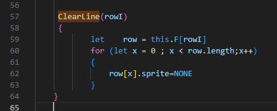
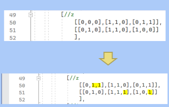

## opdracht

- Git fork https://github.com/progsen/skillbranch met github
- Clone jouw fork (`van jouw repository`) van skillbranch
    - https://github.com/JOUWUSER/ skillbranch 
- Maak 2 nieuwe branches: 
    - bugfix
    - nieuwblock

## juiste directory

open de `js` directory in visual studio code
- werk alleen in deze directory

## bugfix branch opdracht

- Ga naar branch `bugfix`
- Open de javascript file `GameField.js`
- Op regel 62 (zie Plaatje) vervang `NONE` door `NULL`
 
- Commit deze change

## nieuwblock branch

- Ga naar de `main` branch
- Ga naar branch `nieuwblock`
- Open de javascript file `GameContext.js`
- Op regel 50 & 51 vervang je `0` door `1` zoals op het Plaatje in `geel`
 
- Commit deze change

## merge!!

- Ga naar branch main
- git merge bugfix
- Ga naar branch nieuwblock
- Git merge main
- Ga naar branch main
- Git merge nieuwblock

## wat kan je nog meer?

zoek uit:
- hoe je alle branches kan tonen via de command prompt
- hoe je een branche renamed via de command prompt
- hoe je een branche delete via de command prompt
- maak een nieuwe branch: `commands`
- check die branch uit
- schrijf de commandos in een nieuwe text file `branche commands.txt`
- Commit deze change
- Ga naar branch main
- git merge commands

## aftekenen!

laat je werk nu aftekenen
