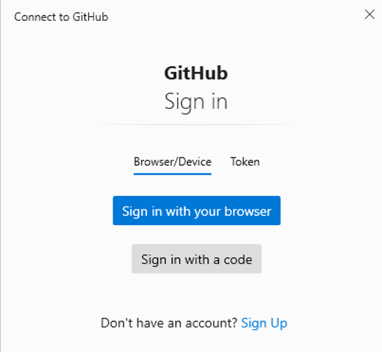
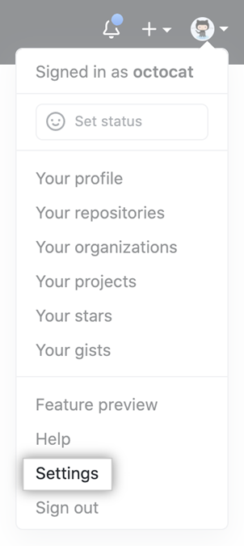
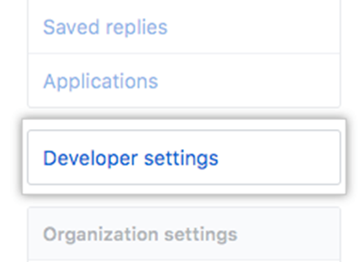
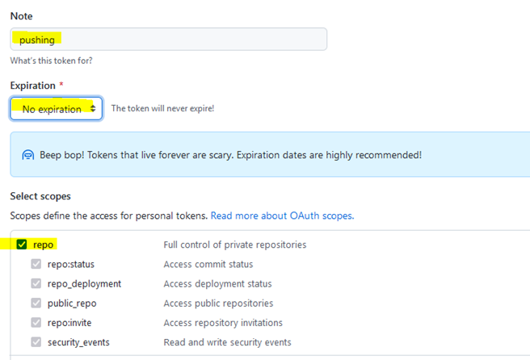
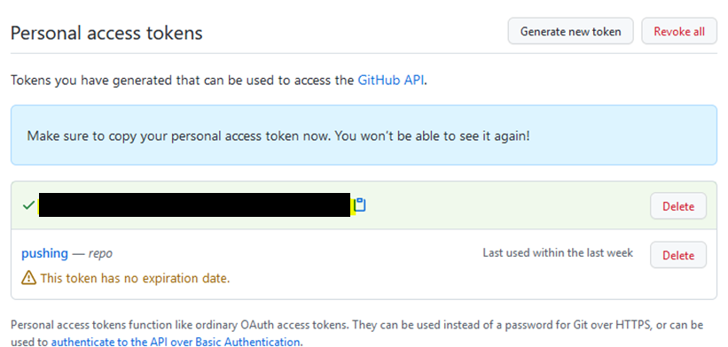
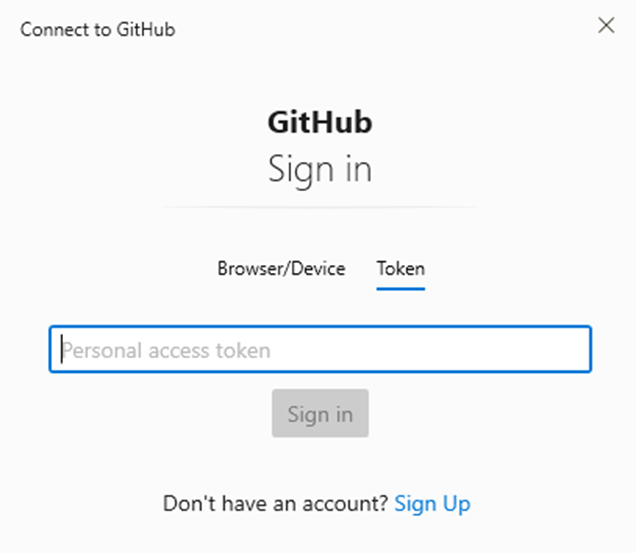

## Lokaal.. en nu?

nu moeten we naar onze github pushen.

laten we dat proberen:
- type `git push` (in je directory met de readme.md file op jou pc)

* Nu krijg je een `login` scherm

## token settings page

we hebben een token nodig:

- ga naar je github in je browser.
- click op je account icoon
- click op settings

- links staat een menu, click op `developer settings`

- click op `personal access tokens`
- click nu op `tokens (classic)`

- click nu op generate token

- click op generate classic token

## token maken

nu kunnen we een token gaan maken:

- vul een naam voor het token in bv (`pushing`)
- Zet de `expiration` op `no expiration` voor nu
- vink de `repo` aan

- als dat goedstaat kan je op `generate token` clicken `onderaan` de pagina

- `LET OP!!!` je krijgt nu je token te zien. Dit is 1 keer!
- sla het token op, bijvoorbeeld in een `wachtwoord manager`

## EINDELIJK!

nu kunnen we inloggen en pushen:

- click op token
- plak je token 
- click op sign in

* zie je dat je `push` nu doorgaat?
- controleer het in je `repository` op `github`
- daar zie je nu 2 commits

## Andere studenten

- clone nu de repository van een andere student naar je pc toe
- maak een aanpassing in de `readme.md`
- wat gebeurt er nu?

* dit klopt!

## inleveren

lever nu je github account link in in de assignment die je gekregen hebt

## Extra leesvoer:

### Github Docs
https://docs.github.com/en

### Personal Acces Tokens
https://en.wikipedia.org/wiki/Personal_access_token

### Github acces tokens:
https://docs.github.com/en/github/authenticating-to-github/keeping-your-account-and-data-secure/creating-a-personal-access-token
